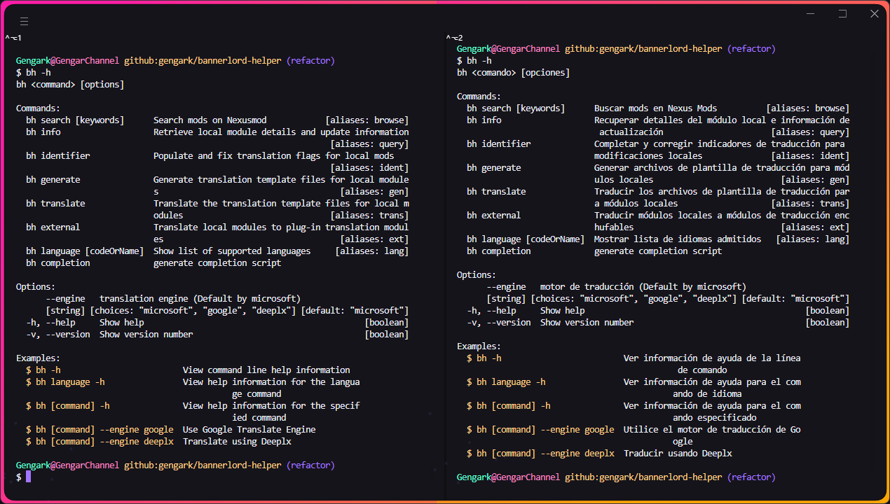

<div align="center">


[](https://nodejs.org/docs/latest/api/)
[](https://packagephobia.com/result?p=bannerlord-helper)
[](https://www.npmjs.com/package/bannerlord-helper)
[](https://github.com/xojs/xo)
[](LICENSE)

Mount & Blade II: Bannerlord için Node.js CLI yardımcı aracı

[English](README.md) | [简体中文](README.zh-CN.md) | Türkçe

</div>

## 📖 Giriş

> `search`: Nexusmod'da modları arayın
>
> `info`: Yerel mod bilgilerini görüntüleyin
>
> `language`: Çevrilebilir dillerin listesini görüntüleyin
>
> `generate`: Çeviri şablonları oluşturun (ModuleData)
>
> `translate`: Çeviri şablonlarını veya bir dili başka bir dile çevirin (ModuleData)
>
> `localize`: Çeviri tanımlayıcılarını doldurun ve onarın, çevirilebilir mod dosyalarını hedef dile çevirin (ModuleData)
>
> `events`: Çeviri tanımlayıcılarını doldurun ve onarın, çevirilebilir mod dosyalarını hedef dile çevirin (Events) (*Experimental*)

## ⚙️ Kurulum

```bash
npm install bannerlord-helper -g
```

## 🚀 Kullanım



```bash
bh <komut> [seçenekler]

Komutlar:
  bh search [query]         Nexus Modlarında mod arayın     [takma adlar: query]
  bh info [keywords]        Yerel mod bilgilerini görüntüleyin
                                                             [takma adlar: view]
  bh language [codeOrName]  Desteklenen dillerin listesini görüntüleyin
                                                             [takma adlar: lang]
  bh generate [keywords]    Çeviri tanımlayıcılarını tamamlayarak çeviri şablonl
                            arı oluşturun                     [takma adlar: gen]
  bh translate [keywords]   Bir dilden diğerine çeviri yapın[takma adlar: trans]
  bh localize [keywords]    Mod dosyalarını hedef dile çevirin
                                                           [takma adlar: locale]
  bh events [keywords]      'Olaylar' dizini için birleştirilmiş 'oluştur' ve 'ç
                            evir' komutları                    [takma adlar: ce]
  bh completion             generate completion script

Seçenekler:
  -h, --help     Yardım detaylarını göster                             [boolean]
  -v, --version  Versiyon detaylarını göster                           [boolean]

Örnekler:
  $ bh -h            CLI yardım bilgilerini görüntüleyin
  $ bh language -h   'Dil' komutuna ilişkin yardım bilgilerini görüntü leyin
  $ bh [command] -h  Belirli bir "komut" için yardım bilgilerini görün tüleme
```

## 🌐 i18n

| Language Name       | Native Name | ISO-639-1 | ISO-3166-1 (Alpha-2) | file                                       |
|:--------------------|:-----------:|:---------:|:--------------------:|:-------------------------------------------|
| English             |      -      |    en     |          US          | [src/locale/en-US.ts](src/locale/en-US.ts) |
| German              |   Deutsch   |    de     |          DE          | [src/locale/de-DE.ts](src/locale/de-DE.ts) |
| Spanish             |   Español   |    es     |          ES          | [src/locale/es-ES.ts](src/locale/es-ES.ts) |
| French              |  Français   |    fr     |          FR          | [src/locale/fr-FR.ts](src/locale/fr-FR.ts) |
| Italian             |  Italiano   |    it     |          IT          | [src/locale/it-IT.ts](src/locale/it-IT.ts) |
| Japanese            |     日本語     |    ja     |          JP          | [src/locale/ja-JP.ts](src/locale/ja-JP.ts) |
| Korean              |     한국어     |    ko     |          KR          | [src/locale/ko-KR.ts](src/locale/ko-KR.ts) |
| Polish              |   Polski    |    pl     |          PL          | [src/locale/pl-PL.ts](src/locale/pl-PL.ts) |
| Portuguese          |  Português  |    pt     |          PT          | [src/locale/pt-PT.ts](src/locale/pt-PT.ts) |
| Russian             |   Русский   |    ru     |          RU          | [src/locale/ru-RU.ts](src/locale/ru-RU.ts) |
| Turkish             |   Türkçe    |    tr     |          TR          | [src/locale/tr-TR.ts](src/locale/tr-TR.ts) |
| Chinese Simplified  |    简体中文     |    zh     |          CN          | [src/locale/zh-CN.ts](src/locale/zh-CN.ts) |
| Chinese Traditional |    繁體中文     |    zh     |          TW          | [src/locale/zh-TW.ts](src/locale/zh-TW.ts) |

## 🎖️ Katkıda Bulunanlar

- [node-translate](https://github.com/kabeep/node-translate) - 🦜 Güçlü, güvenli ve özellik açısından zengin bir Google
  Çeviri API'si.
- [micro-translate-api](https://github.com/Chewawi/microsoft-translate-api) - Node.js için Microsoft Çeviri için basit,
  güçlü ve ücretsiz bir API.

## 🤝 Katkı

Pull Requestler veya [Issues](https://github.com/gengark/bannerlord-helper/issues) yoluyla katkıda bulunabilirsiniz.

## 📄 Lisans

Bu proje MIT Lisansı ile lisanslanmıştır. Ayrıntılar için [LICENSE](LICENSE) dosyasına bakın.
