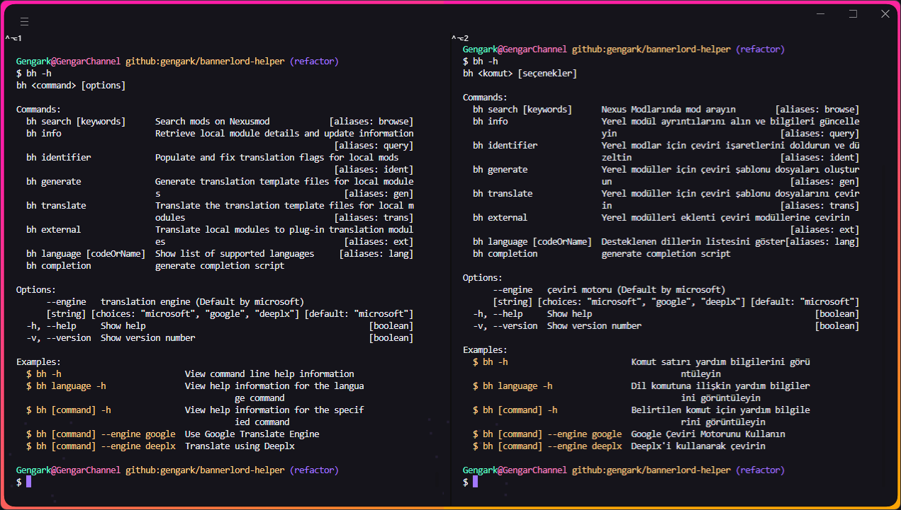
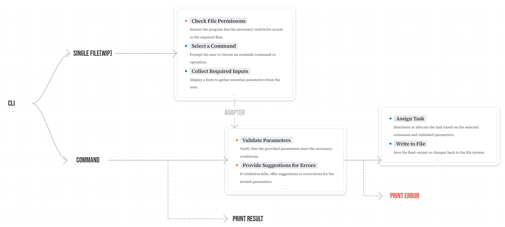

<div align="center">


[](https://nodejs.org/docs/latest/api/)
[](https://packagephobia.com/result?p=bannerlord-helper)
[](https://www.npmjs.com/package/bannerlord-helper)
[](https://github.com/xojs/xo)
[](LICENSE)

[English](README.md) | [简体中文](README.zh-CN.md) | Türkçe

</div>

> [!IMPORTANT]
>
> Yalnızca Windows desteklenir.
> Ayrıntılı bilgi için bkz. [node-steam-library](https://github.com/kabeep/node-steam-library)
> ve [winreg](https://github.com/fresc81/node-winreg).

## 📖 Giriş

Mount & Blade II: Bannerlord mod yaratıcıları için i18n'nin işini kolaylaştırmaya adanmış kullanışlı araçlardan oluşan
bir koleksiyon.

## ⚙️ Kurulum

1. Öncelikle bilgisayarda [Node](https://nodejs.org/en)'un kurulu olduğundan ve kurulum yolunun mevcut olduğundan emin
   olun işletim sistemi veya kullanıcı ortamı değişkeninde.

2. Bu cli'yi NPM aracılığıyla herhangi bir terminale kurun (cmd/bash/powershell/...).

    ```bash
    npm install bannerlord-helper --global
    ```

3. (Kurulum başarılı olursa bu adımı atlayın) Kurulum başarısız olursa öncelikle Node'un doğru şekilde kurulduğundan emin
   olun.

    ```bash
    # Sürüm numarasını yazdırdığınızda doğru şekilde yüklenecektir. eg. `10.7.0`
    # `npm: command not found` Node'un doğru şekilde kurulmadığını veya kullanıcı ortam değişkeninde yolun bulunmadığını belirtir
    npm -v
    ```

4. (Kurulum başarılı olursa bu adımı atlayın) Düğüm normal şekilde kurulmadıysa kurulum yolunu ve kullanıcı ortamı
   değişkenlerini kontrol edin veya ekleyin.

   > Nasıl yapılacağını bilmiyorsanız şunları deneyebilirsiniz: Node'un
   > resmi [önceden oluşturulmuş yükleyicisini](https://nodejs.org/zh-cn/download/prebuilt-installer) doğrudan yükleyin.

5. Cli'nin başarıyla yüklenip yüklenmediğini kontrol etmek için yardım komutunu çalıştırın.

    ```bash
    bh -h
    ```

## 🚀 Kullanım



```
bh <komut> [seçenekler]

Commands:
  bh search [keywords]      Nexus Modlarında mod arayın        [aliases: browse]
  bh info                   Yerel modül ayrıntılarını alın ve bilgileri güncelle
                            yin                                 [aliases: query]
  bh identifier             Yerel modlar için çeviri işaretlerini doldurun ve dü
                            zeltin                              [aliases: ident]
  bh generate               Yerel modüller için çeviri şablonu dosyaları oluştur
                            un                                    [aliases: gen]
  bh translate              Yerel modüller için çeviri şablonu dosyalarını çevir
                            in                                  [aliases: trans]
  bh external               Yerel modülleri eklenti çeviri modüllerine çevirin
                                                                  [aliases: ext]
  bh language [codeOrName]  Desteklenen dillerin listesini göster[aliases: lang]
  bh completion             generate completion script

Options:
      --engine   çeviri motoru (Default by microsoft)
      [string] [choices: "microsoft", "google", "deeplx"] [default: "microsoft"]
  -h, --help     Show help                                             [boolean]
  -v, --version  Show version number                                   [boolean]

Examples:
  $ bh -h                         Komut satırı yardım bilgilerini görü
                                            ntüleyin
  $ bh language -h                Dil komutuna ilişkin yardım bilgiler
                                            ini görüntüleyin
  $ bh [command] -h               Belirtilen komut için yardım bilgile
                                            rini görüntüleyin
  $ bh [command] --engine google  Google Çeviri Motorunu Kullanın
  $ bh [command] --engine deeplx  Deeplx'i kullanarak çevirin
```

## 🕹️ Emretmek

### Ortam Değişkenleri

| İsim         | Varsayılan | Tanım                                      |
|:-------------|:----------:|:-------------------------------------------|
| DEEPLX_PORT  |    1188    | DeepLX'in yerel servis bağlantı noktası    |
| DEEPLX_TOKEN |     -      | API'nizi korumak için belirtecinize erişin |

### Ortak Seçenekler

| İsim    |   Tip   | kısaltma | Gerekli |            Seçimler             | Varsayılan  | Tanım                                           |
|:--------|:-------:|:--------:|:-------:|:-------------------------------:|:-----------:|:------------------------------------------------|
| engine  | string  |    -     |  HAYIR  | "microsoft", "google", "deeplx" | "microsoft" | çeviri motoru (Microsoft tarafından varsayılan) |
| help    | boolean |    h     |  HAYIR  |                -                |      -      | Yardımı göster                                  |
| version | boolean |    v     |  HAYIR  |                -                |      -      | Sürüm numarasını göster                         |

### search

Takma ad: browse

> `NexusMod` larında mod arayın

| Seçenek  |  Tip   | kısaltma | Gerekli | Varsayılan | Tanım                                               |
|:---------|:------:|:--------:|:-------:|:----------:|:----------------------------------------------------|
| keywords | string |    k     |  Evet   |     -      | Modül adı anahtar kelimesi                          |
| language | string |    l     |  HAYIR  |    "EN"    | Yerel mod listesi adları için dil kodlarını çevirin |

**Example**

- `$ bh search "ButterLib"`: Terminalde Nexusmod'da Butter Lib modülünün ayrıntılarını göster
- `$ bh search "改良驻军" --language="cns"`: Modülleri aramak ve arama sonucu adlarını çevirmek için Basitleştirilmiş
  Çince'yi kullanın
- `$ bh search "Diplomacia" --language="sp" --engine="google"`: Google Çeviri aracılığıyla İspanyolca modülleri bulun ve
  çevirin
- `$ bh browse -k Diplomacy -l tr`: Komut satırlarını basitleştirmek için takma adlar kullanın

### info

Takma ad: query

> Yerel modül ayrıntılarını alın ve bilgileri güncelleyin

| Seçenek  |   Tip   | kısaltma | Gerekli | Varsayılan | Tanım                                                    |
|:---------|:-------:|:--------:|:-------:|:----------:|:---------------------------------------------------------|
| language | string  |    l     |  HAYIR  |    "EN"    | Yerel mod listesi adları için dil kodlarını çevirin      |
| reset    | boolean |    r     |  HAYIR  |   false    | Nexus Modlarına bağlı seçili modları yeniden indeksleyin |

**Example**

- `$ bh info --language="cns"`: Arama sonucu adlarını Basitleştirilmiş Çince kullanarak çevirme
- `$ bh view -l cns`: Komut satırlarını basitleştirmek için takma adlar kullanın

### identifier

Takma ad: ident

> Yerel modlar için çeviri işaretlerini doldurun ve düzeltin

| Seçenek  |  Tip   | kısaltma | Gerekli | Varsayılan | Tanım                                               |
|:---------|:------:|:--------:|:-------:|:----------:|:----------------------------------------------------|
| language | string |    l     |  HAYIR  |    "EN"    | Yerel mod listesi adları için dil kodlarını çevirin |

**Example**

- `$ bh identifier --language="cns"`: Arama sonucu adlarını Basitleştirilmiş Çince kullanarak çevirme
- `$ bh ident -l cns`: Komut satırlarını basitleştirmek için takma adlar kullanın

### generate

Takma ad: gen

> Yerel modüller için çeviri şablonu dosyaları oluşturun

| Seçenek  |   Tip   | kısaltma | Gerekli | Varsayılan | Tanım                                                       |
|:---------|:-------:|:--------:|:-------:|:----------:|:------------------------------------------------------------|
| language | string  |    l     |  HAYIR  |    "EN"    | Yerel mod listesi adları için dil kodlarını çevirin         |
| to       | string  |    t     |  HAYIR  |    "EN"    | Hedef dil kodu (kaynak dosya metninin dili)                 |
| force    | boolean |    -     |  HAYIR  |   false    | Mevcut dosyaları temizleyin ve şablonları yeniden oluşturun |

**Example**

- `$ bh generate`: Bir çeviri İngilizce şablonu oluşturun ve bunu Diller kök dizinine aktarın
- `$ bh generate -to="tr"`: Çeviri Türkçe şablonunu oluşturun ve Diller/TR dizinine aktarın
- `$ bh generate -to="chinese simplified"`: Basitleştirilmiş Çince çeviri şablonu oluşturun ve onu Diller/CNs dizinine
  aktarın
- `$ bh gen -t cns`: Komut satırlarını basitleştirmek için takma adlar kullanın

### translate

Takma ad: trans

> Yerel modüller için çeviri şablonu dosyalarını çevirin

| Seçenek |  Tip   | kısaltma | Gerekli | Varsayılan | Tanım                                          |
|:--------|:------:|:--------:|:-------:|:----------:|:-----------------------------------------------|
| to      | string |    t     |  Evet   |     -      | hedef dil kodu                                 |
| from    | string |    f     |  HAYIR  |    "EN"    | Kaynak metin dil kodu                          |
| prefix  | string |    p     |  HAYIR  |     -      | Çevrilen her metne bir önek ekleyin            |
| force   | string |    -     |  HAYIR  |   false    | Mevcut dosyaları temizleyin ve yeniden çevirin |

**Example**

- `$ bh translate --to="cns"`: Diller kök dizinindeki İngilizce çeviri şablonunu Basitleştirilmiş Çince'ye çevirin ve
  Diller/CNs dizinine aktarın
- `$ bh translate --from="cns" --to="Japanese"`: Languages/CNs dizinindeki Basitleştirilmiş Çince şablonunu Japoncaya
  çevirin ve Languages/JP kök dizininde oluşturun
- `$ bh translate --to="cns" --prefix="[CNS]"`: İngilizce şablonu Basitleştirilmiş Çince'ye çevirin ve Diller/CNs
  dizininde oluşturun ve çevrilen her metne [CNS] önekini ekleyin
- `$ bh translate --to="cns" --force`: Languages/CNs dizinini temizleyin ve İngilizce şablonu Basitleştirilmiş Çince'ye
  çevirin ve Languages/CNs dizinine aktarın
- `$ bh trans -f en -t cns -p [CNS]`: Komut satırlarını basitleştirmek için takma adlar kullanın

### external

Takma ad: ext

> Yerel modülleri eklenti çeviri modüllerine çevirin

| Seçenek |  Tip   | kısaltma | Gerekli | Varsayılan | Tanım                                          |
|:--------|:------:|:--------:|:-------:|:----------:|:-----------------------------------------------|
| to      | string |    t     |  Evet   |     -      | hedef dil kodu                                 |
| from    | string |    f     |  HAYIR  |    "EN"    | Kaynak metin dil kodu                          |
| prefix  | string |    p     |  HAYIR  |     -      | Çevrilen her metne bir önek ekleyin            |
| force   | string |    -     |  HAYIR  |   false    | Mevcut dosyaları temizleyin ve yeniden çevirin |

**Example**

- `$ bh external --to="cns"`: Kaynak dosyayı Basitleştirilmiş Çince şablonuna çevirin ve ../Module Name CNs/ModuleData
  dizinine aktarın
- `$ bh external --to="cns" --prefix="[CNS]"`: Kaynak dosyayı Basitleştirilmiş Çince'ye çevirin, ../Module Name
  CNs/ModuleData dizinine aktarın ve çevrilen her metne [CNS] önekini ekleyin
- `$ bh external --to="cns" --force`: ../Module Name CNs/ModuleData dizinini temizleyin, kaynak dosyaları
  Basitleştirilmiş Çince'ye çevirin ve bunları Languages/CNs dizininde oluşturun
- `$ bh ext -f en -t cns -p [CNS]`: Komut satırlarını basitleştirmek için takma adlar kullanın

### language

Takma ad: lang

> Desteklenen dillerin listesini göster

| Seçenek      |  Tip   | kısaltma | Gerekli | Varsayılan | Tanım                 |
|:-------------|:------:|:--------:|:-------:|:----------:|:----------------------|
| code-or-name | string |    -     |  HAYIR  |     -      | Dil kodu veya dil adı |

**Example**

- `$ bh language`: Terminalde Nexusmod'da Butter Lib modülünün ayrıntılarını göster
- `$ bh language cns`: Dil kodu CN'lerinin dil adlarını ve yerelleştirilmiş adlarını görüntüleyin
- `$ bh lang`: Komut satırlarını basitleştirmek için takma adlar kullanın

## ♾️ iş akışı



## 🌐 uluslararasılaşma

| Dil Adı             | Yerel Ad  | ISO-639-1 | ISO-3166-1 (Alpha-2) | dosya                                      |
|:--------------------|:---------:|:---------:|:--------------------:|:-------------------------------------------|
| English             |     -     |    en     |          US          | [src/locale/en-US.ts](src/locale/en-US.ts) |
| German              |  Deutsch  |    de     |          DE          | [src/locale/de-DE.ts](src/locale/de-DE.ts) |
| Spanish             |  Español  |    es     |          ES          | [src/locale/es-ES.ts](src/locale/es-ES.ts) |
| French              | Français  |    fr     |          FR          | [src/locale/fr-FR.ts](src/locale/fr-FR.ts) |
| Italian             | Italiano  |    it     |          IT          | [src/locale/it-IT.ts](src/locale/it-IT.ts) |
| Japanese            |    日本語    |    ja     |          JP          | [src/locale/ja-JP.ts](src/locale/ja-JP.ts) |
| Korean              |    한국어    |    ko     |          KR          | [src/locale/ko-KR.ts](src/locale/ko-KR.ts) |
| Polish              |  Polski   |    pl     |          PL          | [src/locale/pl-PL.ts](src/locale/pl-PL.ts) |
| Portuguese          | Português |    pt     |          PT          | [src/locale/pt-PT.ts](src/locale/pt-PT.ts) |
| Russian             |  Русский  |    ru     |          RU          | [src/locale/ru-RU.ts](src/locale/ru-RU.ts) |
| Turkish             |  Türkçe   |    tr     |          TR          | [src/locale/tr-TR.ts](src/locale/tr-TR.ts) |
| Chinese Simplified  |   简体中文    |    zh     |          CN          | [src/locale/zh-CN.ts](src/locale/zh-CN.ts) |
| Chinese Traditional |   繁體中文    |    zh     |          TW          | [src/locale/zh-TW.ts](src/locale/zh-TW.ts) |

## 📍 Yol Haritası

- [x] Karmaşık Kodun Yeniden Yapılandırılması
- [x] i18n Yönetiminin Optimize Edilmesi
- [x] Ayrıntılı İşlevselliğin Uygulanması
- [x] DeepLX Desteği
- [x] Xslt dosyasını destekleyin
- [x] Eklenti çeviri modülünü destekleyin
- [x] {=!}'nin Çevrilmemesi Sorununun Giderilmesi
- [x] Nexusmod Verilerinin UTC Zaman Damgası Sorununun Çözülmesi
- [x] Yeniden Kullanılan Metin Öğeleri için Çeviri Tanımlayıcısının Geliştirilmesi
- [x] Yapılandırılabilir XML Tanıma Yolunun İyileştirilmesi
- [ ] Komut şekeri
- [ ] Tek Dosya İşleme Özelliğinin Eklenmesi
- [ ] Dil Dosyaları ve XLSX Arasında Dönüşüm

## 🏅 Katkıda Bulunanlar

- [node-steam-library](https://github.com/kabeep/node-steam-library) - Windows kayıt defteri aracılığıyla Steam'in
  kurulum dizinini ve uygulama listesini elde et.
- [node-translate](https://github.com/kabeep/node-translate) - 🦜 Güçlü, güvenli ve özellik açısından zengin bir Google
  Çeviri API'si.
- [micro-translate-api](https://github.com/Chewawi/microsoft-translate-api) - Node.js için Microsoft Çeviri için basit,
  güçlü ve ücretsiz bir API.
- [node-translate-i18n](https://github.com/kabeep/node-translate-i18n) - 🌏 Yerelleştirme dosyalarını diğer dillere
  çevirmek için bir komut satırı arayüz aracı.

## 🤝 Katkı

Pull Requestler veya [Issues](https://github.com/gengark/bannerlord-helper/issues) yoluyla katkıda bulunabilirsiniz.

<table>
  <tbody>
    <tr>
      <td align="center" valign="top" width="14.28%"><a href="https://github.com/dontkillchicken"><br /><sub><b>dontkillchicken</b></sub></a><br /><a href="mailto:1587409536@qq.com" title="E-posta">✉️</a><a href="https://bbs.mountblade.com.cn/forum.php?mod=viewthread&tid=2097412&highlight=%E6%B1%89%E5%8C%96%E6%95%99%E7%A8%8B" title="Eğitimler">✅</a><a href="#" title="Soru">💬</a><a href="#" title="Test Verisi">🔣</a></td>
    </tr>
  </tbody>
</table>

## 📄 Lisans

Bu proje MIT Lisansı ile lisanslanmıştır. Ayrıntılar için [LICENSE](LICENSE) dosyasına bakın.
