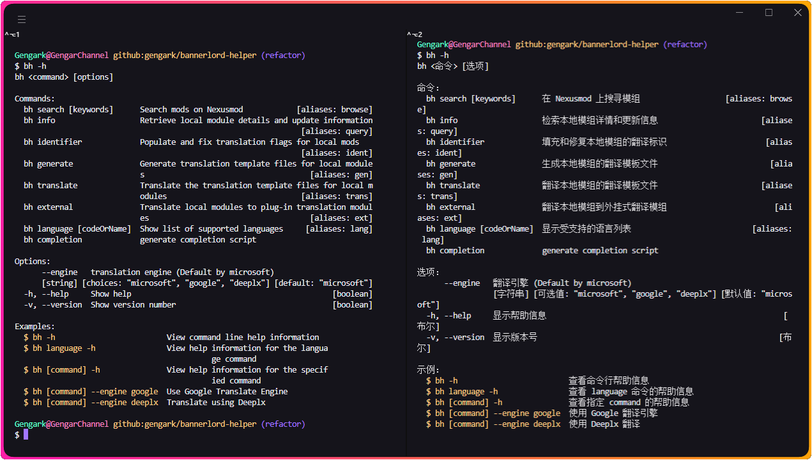
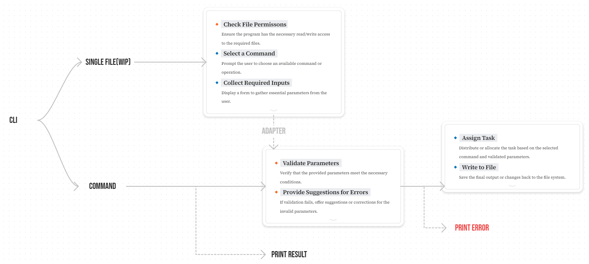

<div align="center">


[](https://nodejs.org/docs/latest/api/)
[](https://packagephobia.com/result?p=bannerlord-helper)
[](https://www.npmjs.com/package/bannerlord-helper)
[](https://github.com/xojs/xo)
[](LICENSE)

[English](README.md) | 简体中文 | [Türkçe](README.tr-TR.md)

</div>

> [!IMPORTANT]
>
> 仅支持 Windows。
> 详细信息请查阅 [node-steam-library](https://github.com/kabeep/node-steam-library)
> 和 [winreg](https://github.com/fresc81/node-winreg).

## 📖 简介

Node.js 的实用终端工具集，致力于让《Mount & Blade II: Bannerlord》**模组创作者**能够更轻松地进行国际化工作。

## 💡 为什么使用 bannerlord-helper?

`bannerlord-helper` 可以帮助 ***翻译贡献者*** 快速创建符合官方标准目录结构和 XML 内容的本地化文件和翻译结果，**让翻译工作只需要专注于翻译**。

即使源模组频繁更新，`bannerlord-helper` 的标识符算法也能让上个版本已翻译的结果被保留和复用，**这意味着之前所作的努力永远不会被浪费**。

对于 ***玩家/游戏爱好者*** 来说，`bannerlord-helper`可以快速准确地将没有国际化的模组翻译成你的语言，
**只需一行命令，然后打开游戏享受**。

## ⚙️ 先决条件

- 确保电脑确保安装了大于 18 版本的 [Node](https://nodejs.org/zh-cn) 程序。
- 安装时勾选了添加到系统环境变量 (path) 的选项 (如有)。

## 📦 安装

1. 在任意终端（cmd/bash/powershell/...）通过 NPM 安装本程序。

    ```bash
    npm install bannerlord-helper --global
    ```

2. (如果安装成功则跳过此步) 如果安装失败，首先确保 Node 正确安装。

    ```bash
    # 打印版本号即正确安装，如：10.7.0
    # 出现 npm: command not found 则表示 Node 未正确安装，或路径不存在于用户环境变量
    npm -v
    ```

3. (如果安装成功则跳过此步) 如果 Node 未正常安装，检查或新增安装路径和用户环境变量。

    > 如果不会操作的话可以查看这张引导图片 [Node 环境变量](./docs/images/node-env-path.zh-CN.png)，或直接安装 Node
    > 官方提供的 [预构建安装程序](https://nodejs.org/zh-cn/download/prebuilt-installer)。

4. 中国大陆地区，某些特殊日期可能会因为网络问题导致 npm install 执行失败，使用 VPN 或执行命令将 NPM 源设置为淘宝技术团队公开的镜像。

    ```bash
    # 等同于我们向淘宝发送要求下载某个程序的消息，淘宝的服务器下载完后，我们再从淘宝的静态资源服务器安装 NPM 上的程序
    npm config set registry https://registry.npmmirror.com
    # 然后再次执行 NPM install
    npm install bannerlord-helper --global
    ```

5. 运行帮助命令检查命令行是否安装成功。

    ```bash
    bh -h
    ```

## 🚀 使用



```
bh <命令> [选项]

命令：
  bh search [keywords]      在 Nexusmod 上搜寻模组                   [aliases: browse]
  bh info                   检索本地模组详情和更新信息                       [aliases: query]
  bh identifier             填充和修复本地模组的翻译标识                      [aliases: ident]
  bh generate               生成本地模组的翻译模板文件                         [aliases: gen]
  bh translate              翻译本地模组的翻译模板文件                       [aliases: trans]
  bh external               翻译本地模组到外挂式翻译模组                        [aliases: ext]
  bh language [codeOrName]  显示受支持的语言列表                           [aliases: lang]
  bh completion             generate completion script

选项：
      --engine   翻译引擎 (Default by microsoft)
                 [字符串] [可选值: "microsoft", "google", "deeplx"] [默认值: "microsoft"]
  -h, --help     显示帮助信息                                                     [布尔]
  -v, --version  显示版本号                                                      [布尔]

示例：
  $ bh -h                         查看命令行帮助信息
  $ bh language -h                查看 language 命令的帮助信息
  $ bh [command] -h               查看指定 command 的帮助信息
  $ bh [command] --engine google  使用 Google 翻译引擎
  $ bh [command] --engine deeplx  使用 Deeplx 翻译
```

## 🕹️ 命令

### 环境变量

| 名称           | 默认值  | 描述             |
|:-------------|:----:|:---------------|
| DEEPLX_PORT  | 1188 | DeepLX 本地服务端口  |
| DEEPLX_TOKEN |  -   | 用于保护 API 的访问令牌 |

### 公共选项

| 名称      | 类型  | 缩写 | 必需 |             Choices             |     默认值     | 描述                    |
|:--------|:---:|:--:|:--:|:-------------------------------:|:-----------:|:----------------------|
| engine  | 字符串 | -  | 否  | "microsoft", "google", "deeplx" | "microsoft" | 翻译引擎 (默认使用 Microsoft) |
| help    | 布尔  | h  | 否  |                -                |      -      | 显示帮助信息                |
| version | 布尔  | v  | 否  |                -                |      -      | 显示版本号                 |

### search

别名: browse

> 在 `Nexusmod` 上搜寻模组

| 参数       | 类型  | 缩写 | 必需 | 默认值  | 描述                      |
|:---------|:---:|:--:|:--:|:----:|:------------------------|
| keywords | 字符串 | k  | 是  |  -   | 模组名称关键字                 |
| language | 字符串 | l  | 否  | "EN" | 翻译 Nexusmod 模组列表名称的语言代码 |

**Example**

- `$ bh search "ButterLib"`: 在终端展示 Nexusmod 上 Butter Lib 模组的详细信息
- `$ bh search "改良驻军" --language="cns"`: 使用 简体中文 搜索模组并翻译搜索结果名称
- `$ bh search "Diplomacia" --language="sp" --engine="google"`: 过 Google 翻译并使用 西班牙语 查找和翻译模组
- `$ bh browse -k Diplomacy -l tr`: 使用别名简化命令行

### info

别名: query

> 检索本地模组详情和更新信息

| 参数       | 类型  | 缩写 | 必需 |  默认值  | 描述                       |
|:---------|:---:|:--:|:--:|:-----:|:-------------------------|
| language | 字符串 | l  | 否  | "EN"  | 翻译本地模组列表名称的语言代码          |
| reset    | 布尔  | r  | 否  | false | 重新设置所选模组与 Nexusmod 链接的索引 |

**Example**

- `$ bh info --language="cns"`: 使用 简体中文 翻译搜索结果名称
- `$ bh view -l cns`: 使用别名简化命令行

### identifier

别名: ident

> 填充和修复本地模组的翻译标识

| 参数       | 类型  | 缩写 | 必需 | 默认值  | 描述              |
|:---------|:---:|:--:|:--:|:----:|:----------------|
| language | 字符串 | l  | 否  | "EN" | 翻译本地模组列表名称的语言代码 |

**Example**

- `$ bh identifier --language="cns"`: 使用 简体中文 翻译搜索结果名称
- `$ bh ident -l cns`: 使用别名简化命令行

### generate

别名: gen

> 生成本地模组的翻译模板文件

| 参数       | 类型  | 缩写 | 必需 |  默认值  | 描述                |
|:---------|:---:|:--:|:--:|:-----:|:------------------|
| language | 字符串 | l  | 否  | "EN"  | 翻译本地模组列表名称的语言代码   |
| to       | 字符串 | t  | 否  | "EN"  | 目标语言代码 (源文件文本的语言) |
| force    | 布尔  | -  | 否  | false | 清除已存在的文件并重新生成模板   |

**Example**

- `$ bh generate`: 生成翻译 英文 模板, 并导出到 Languages 根目录
- `$ bh generate -to="tr"`: 生成翻译 土耳其语 模板, 并导出到 Languages/TR 目录
- `$ bh generate -to="chinese simplified"`: 生成翻译 简体中文 模板, 并导出到 Languages/CNs 目录
- `$ bh gen -t cns`: 使用别名简化命令行

### translate

别名: trans

> 翻译本地模组的翻译模板文件

| 参数     | 类型  | 缩写 | 必需 |  默认值  | 描述            |
|:-------|:---:|:--:|:--:|:-----:|:--------------|
| to     | 字符串 | t  | 是  |   -   | 目标语言代码        |
| from   | 字符串 | f  | 否  | "EN"  | 源文本语言代码       |
| prefix | 字符串 | p  | 否  |   -   | 为每项翻译文本添加前缀   |
| force  | 布尔  | -  | 否  | false | 清除已存在的文件并重新翻译 |

**Example**

- `$ bh translate --to="cns"`: 将 Languages 根目录的 英文 翻译模板翻译成 简体中文, 并导出到 Languages/CNs 目录
- `$ bh translate --from="cns" --to="Japanese"`: 将 Languages/CNs 目录的 简体中文 模板翻译成 日文, 并生成到 Languages/JP
  根目录
- `$ bh translate --to="cns" --prefix="[CNS]"`: 将 英文 模板翻译成 简体中文 生成到 Languages/CNs 目录,
  并为每项翻译文本添加 [CNS] 前缀
- `$ bh translate --to="cns" --force`: 清空 Languages/CNs 目录并将 英文 模板翻译成 简体中文, 并导出到 Languages/CNs 目录
- `$ bh trans -f en -t cns -p [CNS]`: 使用别名简化命令行

### external

别名: ext

> 翻译本地模组到外挂式翻译模组

| 参数     | 类型  | 缩写 | 必需 |  默认值  | 描述            |
|:-------|:---:|:--:|:--:|:-----:|:--------------|
| to     | 字符串 | t  | 是  |   -   | 目标语言代码        |
| from   | 字符串 | f  | 否  | "EN"  | 源文本语言代码       |
| prefix | 字符串 | p  | 否  |   -   | 为每项翻译文本添加前缀   |
| force  | 字符串 | -  | 否  | false | 清除已存在的文件并重新翻译 |

**Example**

- `$ bh external --to="cns"`: 将源文件翻译成 简体中文 模板, 并导出到 ../Module Name CNs/ModuleData 目录
- `$ bh external --to="cns" --prefix="[CNS]"`: 将源文件翻译成 简体中文, 导出到 ../Module Name CNs/ModuleData 目录,
  并为每项翻译文本添加 [CNS] 前缀
- `$ bh external --to="cns" --force`: 清空 ../Module Name CNs/ModuleData 目录, 将源文件翻译成 简体中文, 并生成到
  Languages/CNs 目录
- `$ bh ext -f en -t cns -p [CNS]`: 使用别名简化命令行

### language

别名: lang

> 显示受支持的语言列表

| 参数           | 类型  | 缩写 | 必需 | 默认值 | 描述        |
|:-------------|:---:|:--:|:--:|:---:|:----------|
| code-or-name | 字符串 | -  | 否  |  -  | 语言代码或语言名称 |

**Example**

- `$ bh language`: 在终端展示 Nexusmod 上 Butter Lib 模组的详细信息
- `$ bh language cns`: 查看语言代码 CNs 的语言名称和本地化名称
- `$ bh lang`: 使用别名简化命令行

## ♾️ 工作流程



## 🌐 国际化

| 语言名称                |   本地名称    | ISO-639-1 | ISO-3166-1 (Alpha-2) | 文件                                         |
|:--------------------|:---------:|:---------:|:--------------------:|:-------------------------------------------|
| English             |     -     |    en     |          US          | [src/locale/en-US.ts](src/locale/en-US.ts) |
| German              |  Deutsch  |    de     |          DE          | [src/locale/de-DE.ts](src/locale/de-DE.ts) |
| Spanish             |  Español  |    es     |          ES          | [src/locale/es-ES.ts](src/locale/es-ES.ts) |
| French              | Français  |    fr     |          FR          | [src/locale/fr-FR.ts](src/locale/fr-FR.ts) |
| Italian             | Italiano  |    it     |          IT          | [src/locale/it-IT.ts](src/locale/it-IT.ts) |
| Japanese            |    日本語    |    ja     |          JP          | [src/locale/ja-JP.ts](src/locale/ja-JP.ts) |
| Korean              |    한국어    |    ko     |          KR          | [src/locale/ko-KR.ts](src/locale/ko-KR.ts) |
| Polish              |  Polski   |    pl     |          PL          | [src/locale/pl-PL.ts](src/locale/pl-PL.ts) |
| Portuguese          | Português |    pt     |          PT          | [src/locale/pt-PT.ts](src/locale/pt-PT.ts) |
| Russian             |  Русский  |    ru     |          RU          | [src/locale/ru-RU.ts](src/locale/ru-RU.ts) |
| Turkish             |  Türkçe   |    tr     |          TR          | [src/locale/tr-TR.ts](src/locale/tr-TR.ts) |
| Chinese Simplified  |   简体中文    |    zh     |          CN          | [src/locale/zh-CN.ts](src/locale/zh-CN.ts) |
| Chinese Traditional |   繁體中文    |    zh     |          TW          | [src/locale/zh-TW.ts](src/locale/zh-TW.ts) |

## 📍 计划项

- [x] 重构核心代码
- [x] 优化 i18n 管理
- [x] 实现细颗粒功能
- [x] 支持 DeepLX
- [x] 支持 xslt 文件
- [x] 支持生成外挂式翻译模组
- [x] 修复 {=!} 不应被翻译的问题
- [x] 解决 Nexusmod 数据时间为 UTC 的问题
- [x] 复用文本项的翻译标识
- [x] 优化可配置的 XML 识别路径
- [ ] 命令糖
- [ ] 新增单文件处理特性
- [ ] 支持语言文件与 XLSX 双向转译

## 🏅 致谢

- [node-steam-library](https://github.com/kabeep/node-steam-library) - 通过 Windows 注册表获取 Steam 的安装目录和应用列表。
- [node-translate](https://github.com/kabeep/node-translate) - 🦜 一个强大、安全且功能丰富的 API，通过 Google 翻译
- [micro-translate-api](https://github.com/Chewawi/microsoft-translate-api) - 适用于 Node.js 的 Microsoft Translator
  的简单、强大且免费的 API
- [node-translate-i18n](https://github.com/kabeep/node-translate-i18n) - 🌏 用于将本地化文件翻译为其他语言的命令行界面工具。

## 🤝 贡献

欢迎通过 Pull Requests 或 [Issues](https://github.com/gengark/bannerlord-helper/issues) 来贡献你的想法和代码。

<table>
  <tbody>
    <tr>
      <td align="center" valign="top" width="14.28%"><a href="https://github.com/dontkillchicken"><br /><sub><b>dontkillchicken</b></sub></a><br /><a href="mailto:1587409536@qq.com" title="邮箱">✉️</a><a href="https://bbs.mountblade.com.cn/forum.php?mod=viewthread&tid=2097412&highlight=%E6%B1%89%E5%8C%96%E6%95%99%E7%A8%8B" title="博客">📝</a><a href="#" title="讨论">💬</a><a href="#" title="测试数据">🔣</a></td>
    </tr>
  </tbody>
</table>

## 📄 许可

本项目采用 MIT 许可证。详情请见 [LICENSE](LICENSE) 文件。
